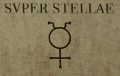

# Alchemia notes  

# Table of Contents
1. [Front Cover](#front-cover)
2. [Page 1](#page-1)
3. [Page 2](#page-2)
4. [Page 3](#page-3)
5. [Page 4](#page-4)
6. [Page 5](#page-5)
7. [Page 6](#page-6)
8. [Page 7](#page-7)
9. [Page 8](#page-8)
10. [Page 9](#page-9)
11. [Page 10](#page-10)
12. [Page 11](#page-11)
13. [Page 12](#page-12)
14. [Page 13](#page-13)
15. [Page 14](#page-14)
16. [Back cover](#back-cover)

## Front cover  
```
Alchemia
```
nothing else, doesn't seem like anything important  
## Page 1  
```
                ALCHEMIA
    or the ftudy of elements and their
            transformations.

    Authored by Natural Philofopher
    and revered Benedictine brother,
            BASIL VALENTINE

    Containing facred knowledge on the
    creation of the Philofopher's ftone
    and the fecret Arcanums of Nature.

        Dedicated to his maiefty,
            KING RVDOLPH II

        COGNITIONIS EST DONVM DEI

    Printed in London by E.G Priestly.
Translated into English for the first time

            Anno MDCLXXXVIII
```
s -> f  
u -> v  
COGNITIONIS EST DONVM DEI -> Knowledge is the gift of god  
Anno MDCLXXXVIII -> Year 1688  
[King Rudolph II ](https://en.wikipedia.org/wiki/Rudolf_II,_Holy_Roman_Emperor)  
[Basil Valentine](https://en.wikipedia.org/wiki/Basil_Valentine)  
## Page 2  
  
```
LIBER LIBRVM APERIT
```
LIBER LIBRVM APERIT -> The book opens  
## Page 3  
```
            To the Reader,
There is no more holy and noble purfuit
than that of alchemy, to ftudy His grand
creation and marvel at its wondrous
beauty. Our fociety is forever indebted to the
work of fages paft, for without them we would
have no bricks or glass, no ink or aper, no
beer or wine, no falts or metals and no
adequate medicines.

The goal of all good and holy alchemifts fhould
be to aid the poor through chryfopeia and heal
the fick though chemiatria, however fome
would feek to use this great knowledge for their
own wicked means. To that end I write my
instructions as plainly as I dare, to illuminate
for the adept but make a fool of the unjuft.

B.V.

        ARS LONGA, VITA BREVIS
```
ARS LONGA, VITA BREVIS -> Art is long, life is short  
## Page 4  
  
```
Remove the falfe emblems and leave only true,
rearrange what remains to build the key anew.

    A Tyrolefe printmaker hides but one,
   another with the canon of Bridlington.

     Fauft holds two for all his glory,
the laft in the eternal alchemist's laboratory.

          ABSCONDITA EST INSIGNE
             (male symbol)
```
  
ABSCONDITA EST INSIGNE -> Hidden badge  
## Page 5  
  
```
        At Babel our tongue did fplit,
    but through gematria a link ftill fits.

       The fages did imitate in kind,
     so their recipes no other would find.

      Study their works in page and word,
      the firft of each a clue conferred.

                LINGVA MATER
               (female symbol)

```  
  
LINGVA MATER -> Material language?  
the first of each page and word -> clue  
## Page 6  
  
```
        Group by appearance their magnitude revealed,
            if more than pyrite you wifh to yield.

              When with clarity you hope to fee,
                feek the aid of Barlet's key.

               Repealer of the mines royal act,
          only he can bring the unfeen letter back.

                         CHYMISTRY
                     (circle with dot)
```  
  
Y -> E?  
## Page 7  
  
```
        Cicero writes of an ancient machine,
    to calculate the future - furely but a dream.

           The man with the golden nofe,
     arrange the zodiac as his laft work fhows.

     He of the fifth month knows the technique,
  connections plus word forms a key, fo to fpeak.

                  SVPER STELLAE
           (female symbol with horns)
```  
  
SVPER STELLAE -> Above the stars  
fifth month -> May  
Arrange the zodiac signs -> symbols on the bottom  
## Page 8  
  
```
        Text in green the fubftitution will reveal,
              and lift this thrice-great feal.

                firft find Cleopatra's gold,
             next a fecret the fphinx does hold.

               Seek Panopolis' fon but know,
                it ends with a fire below.

                        HISTORIA
                    (young of moon)
```  
  
HISTORIA -> History  
Substitution cipher?  
[Panopolis' son](https://en.wikipedia.org/wiki/Zosimos_of_Panopolis)  
## Page 9  
  
```
                     LXXIV

        Alkaheft will fplit each in twain,
      returning to its elements once again.

         Ordered with Eratofthene's aid,
      numbers to letters two texts are made.

       Take the firft of each in sequence,
           to this proof lend credence.

                NVMERO SANCTVM
                (number four)
```  
  
LXXIV -> 74  
NVMERO SANCTVM -> To the number of the holy  
[Eratosthene](https://en.wikipedia.org/wiki/Eratosthenes)  
Turn numbers to letters in two texts  
Take the first of each in sequence  
## Page 10  
  
```
        Identify these lands hidden in many a great atlas,
              and a country marked by an X thus...

         Cross figmifund's alchemift and Napier's bones,
        Magus of Combwich and one the Barefch codex owns.

           Fill a table ten by five with what you find,
              to lift this fata morgana of the mind.

                          MAPPUS MUNDI
                     (cross with whatever)
```  
  
[Napier's bones](https://en.wikipedia.org/wiki/Napier%27s_bones)  
[Magus of Combwich](https://en.wikipedia.org/wiki/Thomas_Charnock)  
[Baresch codex](https://en.wikipedia.org/wiki/Voynich_manuscript)  
MAPPUS MUNDI -> Map of the world  
## Page 11  
```
        LAPIS
    PHILOSOPHORUM
```  
LAPIS PHILOSOPHORUM -> Philosophers' stone  
## Page 12  
```
               Firft tranfmute the prima materia in an
                    alembic with iron shavings.

           Add 7 parts tin to the micture and heat gently.

            Place the refult in a crucible and mix with
             powered coppe. A blackening of the mixture
                        should be obferved.

         Next diftill with a retort and add drops of liquid
                lead, then leave to stand for an hour.

            Remove impure elements ufing quickfilver and
           aqua fortis. A whitening of the mixture fhould
                           be obferved.

           Place in the philofophical egg for 3 days with
           some filver. A reddening of the mixture fhould 
                           be obferved.

            Multiply with a bafe of five ounces of gold.

                          CLAVES SEPTVM
```  
[Prima materia](https://en.wikipedia.org/wiki/Prima_materia)  
CLAVES SEPTVM -> The seven keys  
## Page 13  
```
                XZ MQ SW   WW DL KS   OU DF AA CE NX
          OY GI CO MY   IQ BH RT NX AA BL DF   GI AA TX AI
              MS OU NP TX CG LP   SU CM XZ NX DF IO BJ
                        NZ IU   AC AI   DN MO

                 NQPZKRGLI GE Y DLVZR ICMC YJW ZM
                      BQWM EOZRSCO WTQGKLHSW

                  JUVYR GENAFZHGNGVBA GB TBYQ ZNL
                      UNIR TYHQRQ ZNAL TERNG

          75 25 53   63 11 25   -- 53 84 -- 35 25 74 45 25
       45 64 55 53 25 74   55 53   83 25 64 54 -- 11 55 53 45
      --55 35 35   74 84 65 15 63 35 25 83 83   32 54 84 -- 25

                  PDACNAW ITGVXUI YHKZHWA TLLXVKX
                    MXWFTGR MEDTUHI RWCQNFX KEW
```  
  
```
              GTPVT JWS ZSE EY OS CNDSPMSI PR RCWETSW
                     QPHESWPSH ZYC HSSU ETSN
```  
  
```
                          MAGNVS ARCANA
```  
MAGNVS ARCANA -> Big arcana  
Seems like ciphers  
## Page 14  
```
Tabula Daemonis

Nomine          Domain          Duces
                Diem|Noctis

Pamerfiel       North|South     10,000
Padiel          West |East      20,000
Camuel          East |South     5,000
Afeliel         West |West      7,500
Barmiel         South|West      2,500
Gediel          East |West      1,000
Afyriel         West |West      5,000
Maferiel        North|North     12,500
Malgaras        West |East      7,500
Dorothiel       South|West      1,250
Vfiel           East |East      2,000
Cabariel        North|East      1,500
Rayfiel         East |North     5,000
Symiel          West |West      6,500
Armadiel        South|North     1,000
Barachus        North|North     5,000

(cool triangle circle symbol)
```  
  
Tabula Daemonis -> Demon's map?  
Nomine -> Name  
Duces -> Leaders  
Diem -> Day  
Noctis -> of the night  
## Back cover  
```
MDCLXXXVIII
```  
MDCLXXXVIII -> 1688   